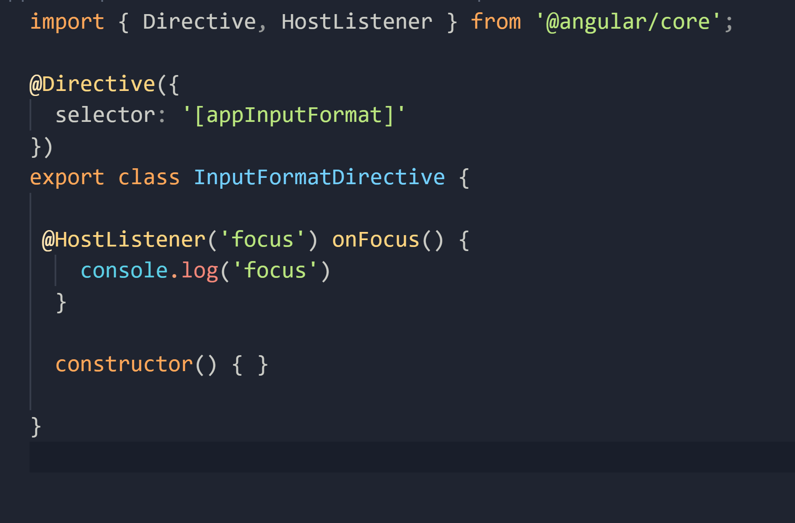
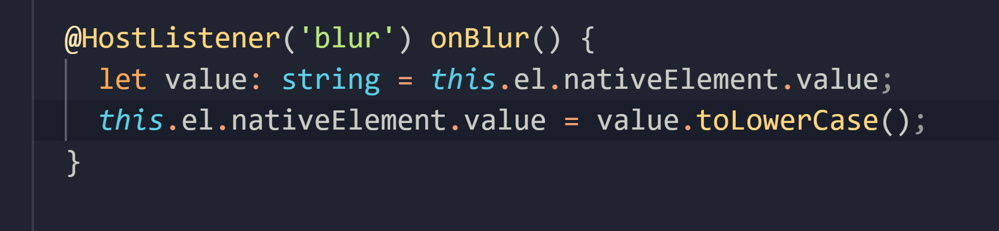

Import HostListner

HostListener - allows us to subscribe to the events raised from the DOM element (the DOM element hosting the Directive or in other words, the DOM element that has this attribute).

Decorate a method that fires upon an event from a DOM element with 'HostListner'

pass the DOM event in string to HostListner

Apply the directive as an attribute to the DOM element using our Directive selector name

With this in place, Angular is going to apply our custom directive to this input field.

Get the value of the input field, first we need a reference to the host element, so in our constructor, we need to inject an element reference object., This is a service defined in Angular that gives us access to DOM elements. It is defined in Angular core.

Note: As a best practice, we should always put our constructor before our methods. It visually helps to ascertain the dependencies of the class.

We need to read the value of the input field

nativeElement property = gives us access to the actual DOM element

Taking this further, it would be nice to tell the directive about a target format either as an upper case or lowercase. So if we had a property like format, we could use property binding like this

One solution, would be to define a field called format and define it with the input property
and modify onBlur method

The issue with this solution is that we have to apply the directive as an attribute and then use property binding to set the target format

Since we only have one input property here, it would be nicer to set the target format while applying the direcvtive as an attribute, like this

This is cleaner and very easy to inplement.

All we have to do is to change this

to this

In concluding, you can use custom directives to have more control over behavior of DOM elements, you can pass data to your directives using input properties and if you have only one property, you can use the selector of that property as an alias for that property and this simplifies the users of your custom directive. Also, finally you can use the HostListner decorator to subscribe to the events raised from the host DOM object.