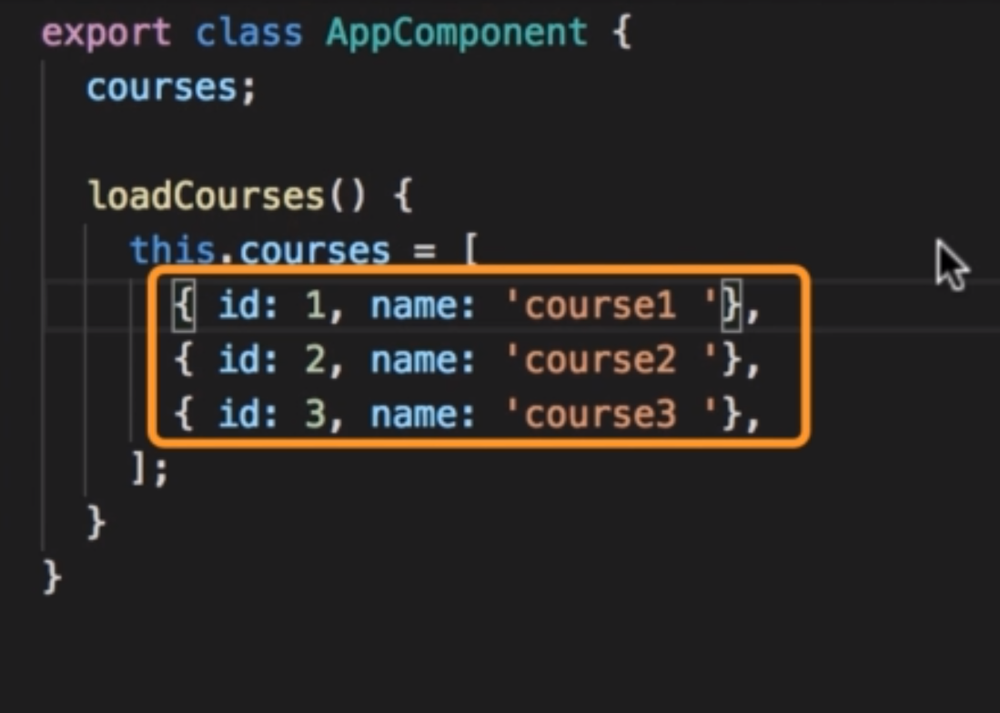
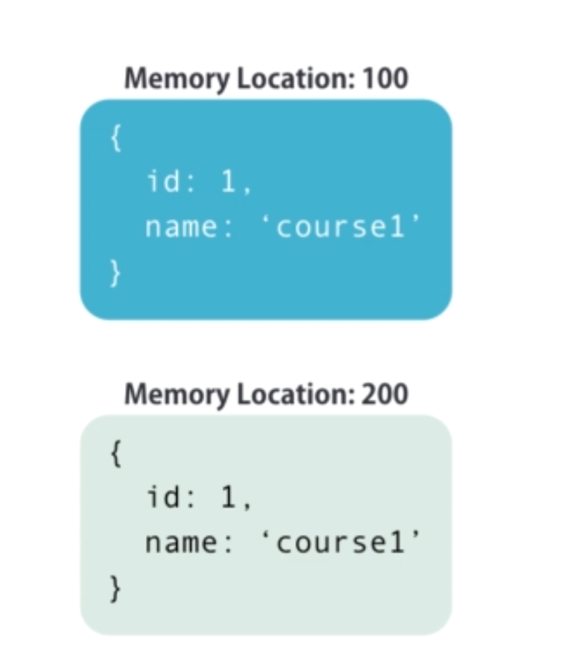
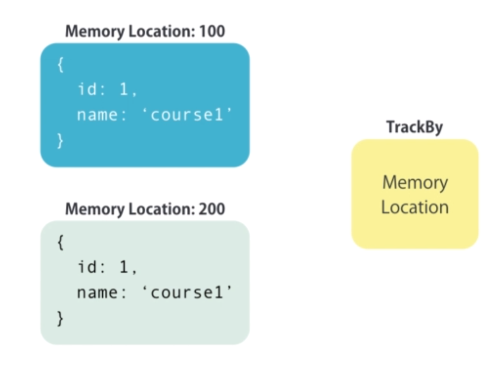
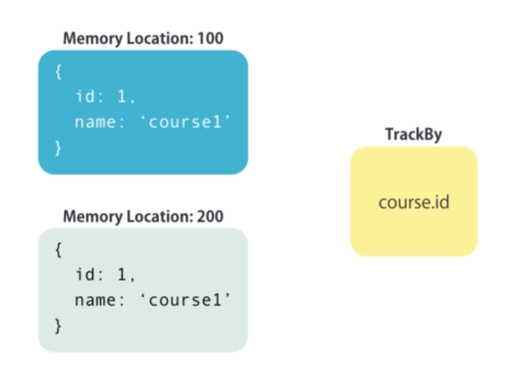
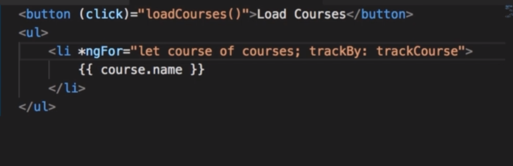
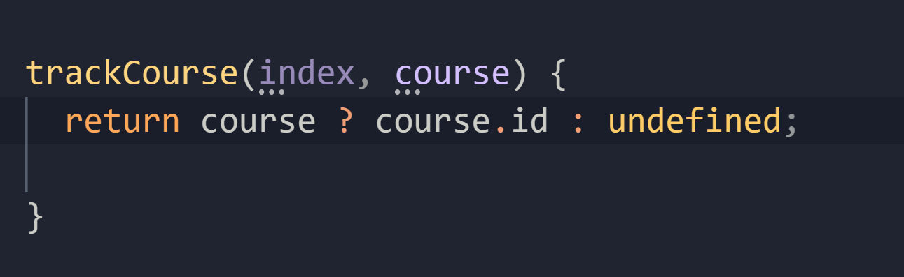
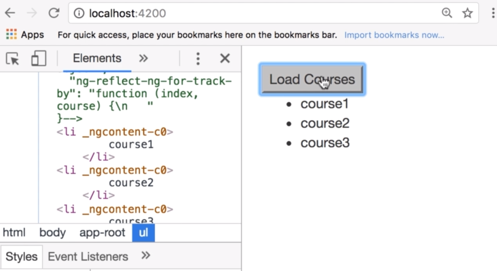

Angular by default tracks objects by their identity. Here we have 3 objects, and these objects have 3 different references in memory.

When we reset this courses fields, even though we are dealing with the exact same content, i.e course id 1, 2 & 3, these objects will be different from the previous objects in memory. So Angular sees this as new content, that's why it reconstructs the DOM tree element.

In Angular's ngFor directive, we have this ability to change how Angular tracks objects, which by default is based on object identity of the reference of that object in memory.

So if you redownload course with id = 1, every time you redownload it, that course is going to be a different object in the memory even though the contents of those objects are going to be equal. 

Now when we instruct Angular to use a different mechanism to track objects. instead of tracking them by their identity or reference in the memory,

we can track them by their id. So course with id = 1 is always course with id = 1. So if you redownload the exact same course from the server, and none of the properties are changed, Angular will not rerender that DOM element.

## Howitzer
In the template, ub the ngFor statement, add trackby abd set to a method in your class (Note that you should not call the method, simply add the name of the method as a reference)

the referenced method (trackCourse in our example) should be setup to take 2 parameters (index, course)

Now with this method, we change how Angular tracks courses3 object. Now instead of tracking them by their object identities, it tracks them by their ids.

You can confirm this behavior by testing using Cgrome browser Dev tools and you'll notice that now when you click the 'Load courses' button, you no longer see the purple flashes on the Ul and its children which was happening before the addition of trackBy to ngFor which indicates that the DOM element is being created. This is no longer the case as wuth the addition on trackBy, Angular now tracks by id thus since it's the same, it's not reremdering the ul and its children.

So here's the lesson, if you are dealing with a simple list, don't worry about the trackBy feature, you don't need it as Angular performs well out of the box. However, if you are dealing with a large list of complex markup and you do observe performance problem on a given page, then try using trackBy to improve the performance of that page. So don't use it by default on every page, that'll just make you write more code and you won't gain any performance benefits, so use it when you need it.