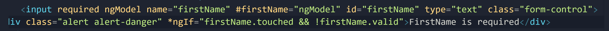

## Zen coding tips for form creation
form>label+input[type='text'].form-control

div.form-group>label[for="comment"]+textarea[id="comment"].form-control

## FormControl
In Angular, we have a class called FormControl. For each input field in our form, we need to create an instance of the control class.

With this control class, we can check the current value stored in an input field, we can see if the input field has been touched or untouched, dirty (which means its value has changed) or pristine (which means its value is unchanged), whether it's valid or not and if not what are the validation errors.

So for each input field in the form, we need a control object

## FormGroup

Now Similar to the FormControl class, we have another class called FormGroup

which represents a group of controls in a form. Each form is essentially a control group. beccause it contains at least one control but in a complex application, you might have a form with multiple control groups, e.g. control group for the shipping address and another for the billingb address. Interestingly, all the properties of the control class that you saw earlier, are also available in the FormGroup class, e.g. we can ask a FormGroup if its valid or not and that becomes true if all the controls in the FormGroup are valid.

Recapping, to add validation to a form, you need to create a FormGroup object for the form and FormControl objects for each input fields in a form. This way we can keep track of each input field in the form and the entire form as well.

## Template Forms (Directives driven) V. Reactive Forms (Code driven)
There are two ways of creating these objects. One way is by applying some directives in our template and Angular will create this control objects for us implicitly under the hood., we call forms that are built this way, template driven forms we build them using their templates.
Another approach involves explicitly creating these control objects, so in our components, we should write code to create new instances of control group and control object. We call forms that are built these way, Reactive forms. Previously, they used to be called Model driven forms.

When using ngModel in a form, you must set the input field's name attribute

When we apply the ngModel directive along with the name attribute on an input field, Angular automatically creates an instance of the form control calss (again, the form control class is used to track state changes and the validity of input fields) and associates it with this input field.

Adding validation errors to input field

## Validation Attributes
In Angular, we have a few built-in validators that are based on HTML5 validation attributes - minlength, maxlength, pattern (can be used with RegEx values), e.g. setting pattern = "banana" means only the word "banana" is a valid value in this input field. Note: that when you have multiple validation attributes, you can not show them all with one div, you have to use seperate divs for each validation error.

The errors object has one or more key - value pairs and the keys are the validation errors.

### Adding multiple validation errors to an input field

### Styling Invalid Input Fields

With input fields, define a template variable and set it to ngModel.
With form, define a template variable and set it to ngForm
ngForm has an Output property named ngSubmit. thus you can use event binding to bind to a method in our class like this:

### ngModelGroup
just as we have NgModel directive, we also have ngModelGroup, directive which you can use for complex objects within a form, say a sunb group like contact or address. So if your application's api may expect a nested object structure, you can use the ngModelGroup directive like this -

Also. similar to ngModel, you can get a reference to this directive using a template reference variable. So here we can define a reference template variabke called 'contact' and set it to ngModelGroup directive. Now we can reference this contact variable any on this template.

This is useful if you wanna validate an entire group as a whole. Let's say you have a group called 'billing details" and you want to display all the validation errors for "billing details" on top of that group, if that's the case, then you'd set it up as below with ngIf

### formControl and formGroup

In Angular, we have 2 classes to keep track of the state of input fields and their validity, one is FormControl which represents only 1 input field, and the other is FormGroup, which represents a group of input fields.

Now, when we apply the ngModel model directive on an input field, Angular directly creates a FormControl object and associates it to that input field.

Now FormGroup class is used to represent an entire form and optionally, groups within a form. As earlier explained, we have a directive called ngForm that is automayically applied to all form elements. So Angular automatically applies the ngForm directive to your forms and this would internally create a FormGroup object and associate it with your form.

With this FormGroup object, you can track state changes of the form and its validity. Now if you have a complex form, with multiple sub groups, you can optionally apply the ngModelGroup directive in a sub group, and this directive is similar to the ngForm directive will also create a FormGroup objectfor that group.
You might be curious as to the fifferences between ngForm and ngModelGroup. The difference is that the ngForm directive exposes and Output property (ngSubmit), which we use to handle the submit event of forms, while ngModelGroup dosen't have that Output property as it dosen't make sense to submit a part of a form.

### Disabling 'Submit' button
bind the button's 'diabled' property to the valid property of the form via the form's template reference variable like this -

##@ Sending more than the value to the server when using a drop down list
In most applications, you want to send only the value of 'option' to the server

But sometimes, you may want to set value of the property, in this example - the 'contactMethod' to the actual contactMethod object, which in this case is an object with 2 properties - 'id' and 'name'. Since options value attribute value can only be a string in HTML, we cannot store an actual contactMethod object here. To solve the issue, we need to go back to our temnplate and instead of bindingb to 'valuer', we binf to 'ngValue'.

### ngValue 
ngValue is an attribute directive that exposes the ngValue property and we can bind it to a complex object. As in the above example, we can now bind ngValue to the contactNethod object like this -

Note: that in most applications, you don't want to do this as what is mostly required is tyhe value property but if you come across a scenerio that requires you to set the property value to a complex object, then use the ngValue directive instead of the standard value property.

### Multiple option for drop down list
Add the multiple attribute to the 'select' element to enable the selection of multiple options in a dropdown list.

